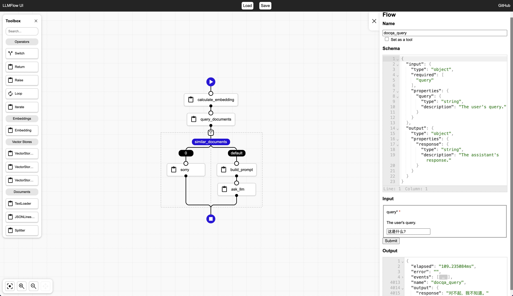

# LLMFlow

[][1]

Orchestration engine & UI for your customized LLM flow.



## Installation

```bash
go install github.com/go-aie/llmflow/cmd/llmflow@latest
```

## Quick Start

### API

Run LLMFlow:

```bash
OPENAI_API_KEY=<YOUR_API_KEY> llmflow
```

Add the example flow:

```bash
curl -XPUT -H 'Content-Type: application/json' 'http://127.0.0.1:8888/api/flows/openai' -d @examples/openai.flow.json
```

Execute the example flow:

```bash
curl -XPOST -H 'Content-Type: application/json' 'http://127.0.0.1:8888/api/flows/openai:run' -d '{"query":"colorful socks"}'
```

> **NOTE**:
> 
> - Setting environment variables is only necessary when running LLMFlow in this example.
> - As an alternative, you can change `api_key` to your API key in [openai.flow.json](examples/openai.flow.json) (see [UI](#ui)), and then run `llmflow` instead.

### UI

Open LLMFlow UI through your browser:

```bash
http://127.0.0.1:8888
```

Then click the `Load` button and select [openai.flow.json](examples/openai.flow.json) to view it in the UI.


## Tasks & Flows

In addition to [Orchestrator's built-in tasks][2], LLMFlow defines the following tasks and flows:

   - Tasks
      + [JSONLinesLoader](loader.go#L49-L170)
      + [Splitter](splitter.go)
      + [Template](template.go)
      + [TextLoader](loader.go#L172-L228)
      + [VectorStore_Delete](vectorstore/vectorstore_delete.go)
      + [VectorStore_Query](vectorstore/vectorstore_query.go)
      + [VectorStore_Upsert](vectorstore/vectorstore_upsert.go)

   - Flows
      + [Embedding](embedding.flow.json)
      + [LLM](llm.flow.json)
      + [xHTTP](xhttp.flow.json)


## Examples

- [Basic](examples/basic.flow.json) (*requires [OneAI][3]*)
- [OpenAI Basic](examples/openai.flow.json) (*requires [OpenAI][5]*)
- Document Question Answering (*requires [OneAI][3]*)
    + [Feed](examples/docqa_feed.flow.json)
    + [Query](examples/docqa_query.flow.json)
- FAQ-based Question Answering (*requires [OneAI][3]*)
    + [Feed](examples/faq_feed.flow.json)
    + [Query](examples/faq_query.flow.json)
- [Table Question Answering](examples/tableqa.flow.json) (*requires [OneAI][3] and [TableQA][4]*)
- Table & Document Question Answering (*requires [OneAI][3] and [TableQA][4]*)
    + [Feed](examples/tableqa_docqa_feed.flow.json)
    + [Query](examples/tableqa_docqa_query.flow.json)


## Documentation

Check out the [documentation][1].


[1]: https://pkg.go.dev/github.com/go-aie/llmflow
[2]: https://github.com/RussellLuo/orchestrator#task
[3]: https://github.com/go-aie/oneai
[4]: https://github.com/go-aie/tableqa
[5]: https://platform.openai.com/docs/api-reference/chat
