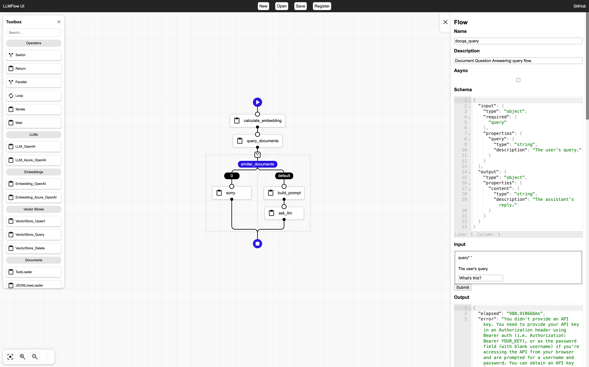

# LLMFlow

[][1]

Orchestration engine & UI for your customized LLM flow.



## Installation

```bash
go install github.com/go-aie/llmflow/cmd/llmflow@latest
```

## Run

1. Run [OneAI][2].

2. Run [Python Code Server](cmd/llmflow/pycode).

3. Run the orchestration engine:

    ```bash
    CODE_API_ENDPOINT=http://127.0.0.1:5000/exec llmflow
    ```


## Tasks & Flows

In addition to [Orchestrator's built-in tasks][3], LLMFlow defines the following tasks and flows:

   - Tasks
      + [JSONLinesLoader](loader.go#L50-L181)
      + [Splitter](splitter.go)
      + [Template](template.go)
      + [TextLoader](loader.go#L183-L239)

   - Flows
      + [Code](code.flow.json)
      + [Embedding](embedding.flow.json)
      + [LLM](llm.flow.json)
      + [VectorStore_Delete](vectorstore_delete.flow.json)
      + [VectorStore_Query](vectorstore_query.flow.json)
      + [VectorStore_Upsert](vectorstore_upsert.flow.json)
      + [xHTTP](xhttp.flow.json)


## Examples

See [examples](examples).


## Documentation

Check out the [documentation][1].


[1]: https://pkg.go.dev/github.com/go-aie/llmflow
[2]: https://github.com/go-aie/oneai
[3]: https://github.com/RussellLuo/orchestrator#task
